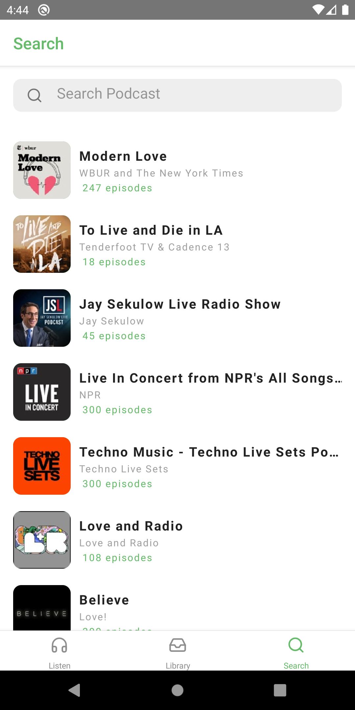
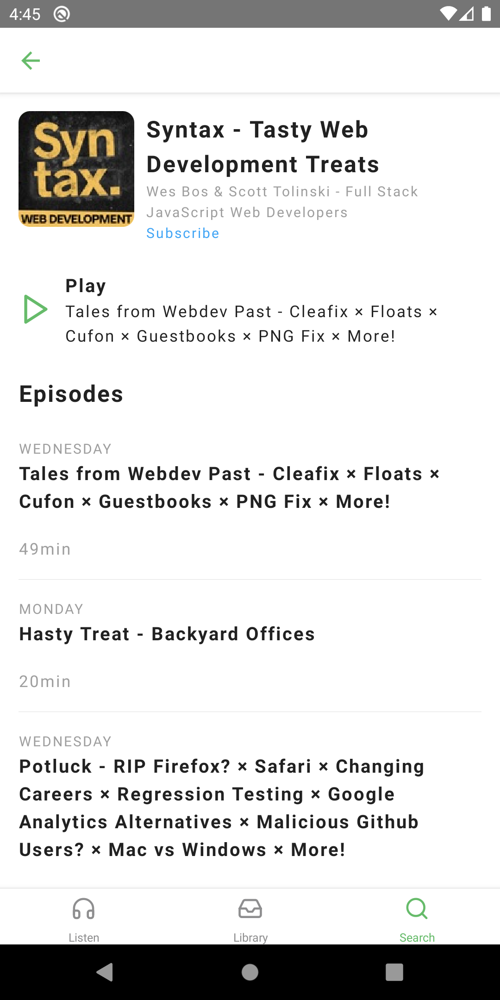
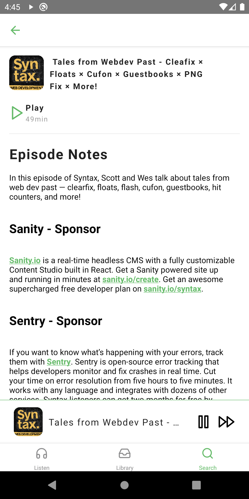
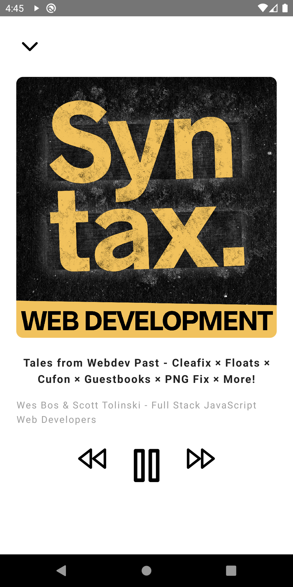
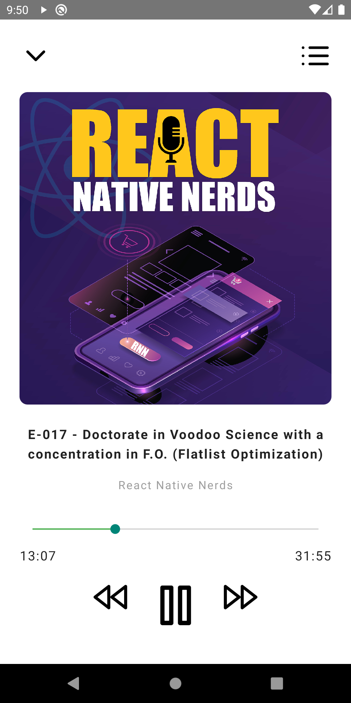
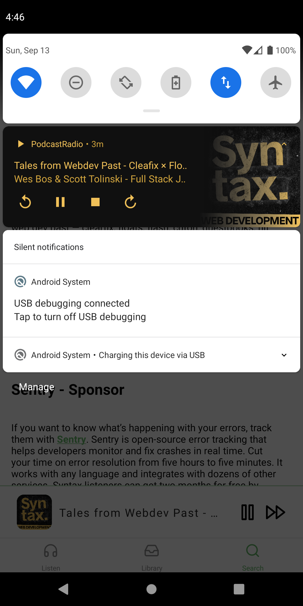

# PodcastRadio

## About / Synopsis

* A podcast app for listening your favourite podcasts on the go.
* Project status: working :smiley:

## Installation
* Download or clone the repo from [here:](https://github.com/Casneil/Podcast_App)
* To install all node modules from the command line run: `yarn install`

### Features
* Sqlite storage
* Mini-player functionality
* Track queuing functionality - work in progress
* Background play functionality
* Forward/Backward seek functionality
* Library for storing your favourite podcast channel

### Requirements

* NodeJs [Official Website](https://nodejs.org/en/download/)
* Yarn [Official Website](https://yarnpkg.com/getting-started/install)
* Android Studio [Official Website](https://developer.android.com/studio)

### Build
    
* Open project in android studio and it will automatically build the project.
* After build succeeded, click the play button to run the the built on your android emulator.
* In your project directory run the command: `yarn android`

### Screenshots
 
 
 

